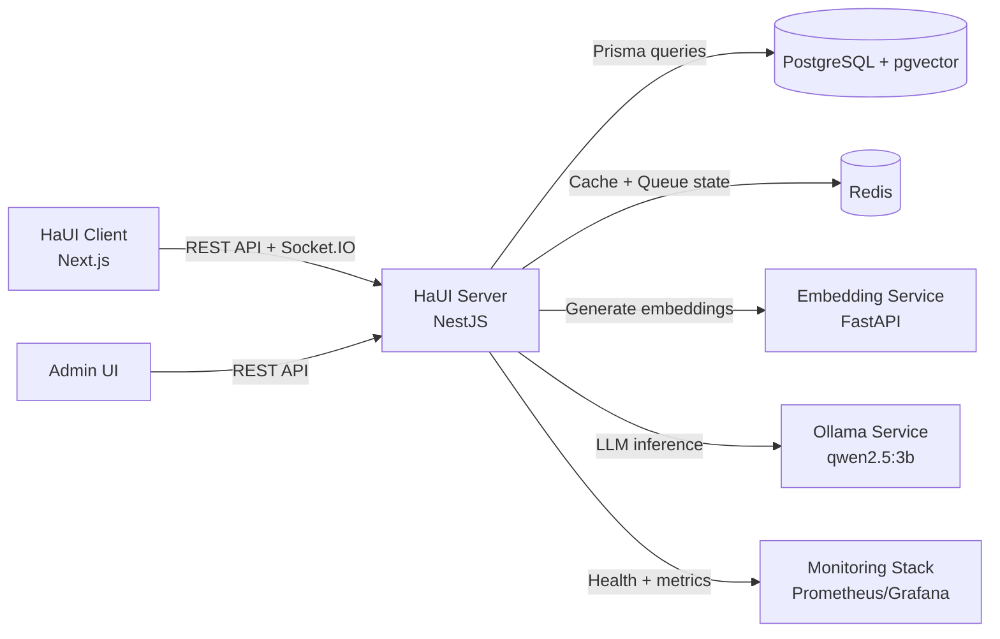

# HaUI Fashion Server

NestJS backend for the HaUI Fashion ecommerce platform.

## Project Overview

This service is the central application backend for the HaUI Fashion ecosystem.
It exposes business APIs for the web client, orchestrates data persistence,
and coordinates AI-related services (embedding + LLM) used by chatbot and search features.

## Core Functions

- Authentication and authorization (customer/admin)
- Catalog, category, order, cart, and profile APIs
- Payment gateway integration flows (VNPay, MoMo)
- Realtime/chat endpoints via Socket.IO
- Product embedding lifecycle orchestration and vector search support
- Operational endpoints (`/health`, `/metrics`) for monitoring

## Stack

- NestJS 11 + Fastify
- Prisma + PostgreSQL (with pgvector support in infra)
- Redis + BullMQ
- Socket.IO
- Swagger (non-production)

## Prerequisites

- Node.js 20+
- pnpm (via Corepack)
- PostgreSQL + Redis (recommended: run via `haui-fashion-infra`)

## Environment

Create `.env` from `.env.example`:

```bash
cp .env.example .env
```

Important keys:

- `PORT` (default `3000`)
- `DATABASE_URL`
- `REDIS_HOST`, `REDIS_PORT`, `REDIS_PASSWORD`, `REDIS_DB`
- `JWT_SECRET`
- `FRONTEND_URL` (comma-separated allowed origins)
- `EMBEDDING_SERVICE_URL` (default `http://localhost:8000`)
- `OLLAMA_BASE_URL` (default `http://localhost:11434`)

## Local Development

```bash
pnpm install
pnpm prisma generate
pnpm start:dev
```

App URLs:

- API base: `http://localhost:3000/api/v1`
- Swagger docs: `http://localhost:3000/docs` (non-production)
- Health: `http://localhost:3000/health`
- Metrics: `http://localhost:3000/metrics`

## Useful Scripts

```bash
pnpm build
pnpm start
pnpm start:prod
pnpm lint
pnpm lint:fix
pnpm format
```

Also available:

- `pnpm data:yody`
- `pnpm data:yody:crawl`
- `pnpm files:migrate-cloudinary`
- `pnpm files:migrate-cloudinary:dry`

## Docker

Build and run with module-level compose:

```bash
docker compose up -d --build
```

For local debug compose profile (opens Node inspector):

```bash
make up-debug
```

Stop local debug compose:

```bash
make down-local
```

## Integration

- Client integration:
  - Serves REST APIs at `http://localhost:3000/api/v1`
  - Enables CORS via `FRONTEND_URL`
  - Socket.IO endpoint is consumed by the frontend chatbot
- Data integration:
  - Uses PostgreSQL for transactional data and embeddings metadata
  - Uses Redis for cache, queues, and background processing state
- AI integration:
  - Calls embedding service via `EMBEDDING_SERVICE_URL`
  - Calls Ollama via `OLLAMA_BASE_URL` for local LLM-assisted flows
- Infra integration:
  - Designed to run with `haui-fashion-infra` network and services

## Infrastructure Diagram



## Notes

- Global API prefix is `api`, versioning is URI-based with default `v1`.
- Health endpoints are not prefixed: `/health`, `/health/liveness`, `/health/readiness`.
